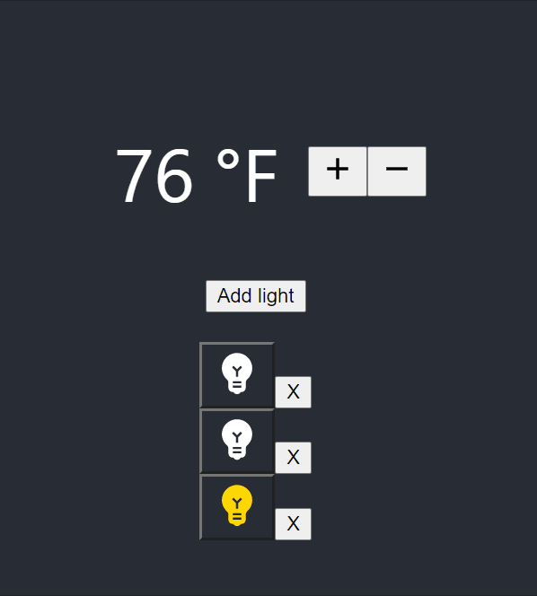

# Full Stack Home Automation

## Overview of the project

Simple application to turn lights on and off and control temperature.



## App functionalities

1. Adding/Removing new light fixtures
2. Turning light on and off
3. Setting and getting thermostat value

## Getting started

### Pre-requisites and Local Development 

Developers using this project should already have Python3, pip and node installed on their local machines.

#### Optional: Setting up virtual environment for the backend:

From the `/backend` folder, follow these instructions to create a virtual environment

On Windows:
```
py -m venv venv
```
On macOS and Linux:
```
python3 -m venv venv
```

To activate it on windows:
```
.\venv\Scripts\activate
```
On macOS and Linux:
```
source env/bin/activate
```

More information is available on the [Python documentation](
https://packaging.python.org/guides/installing-using-pip-and-virtual-environments/)

## Running the project

### Backend
From the `/backend` folder run `pip install requirements.txt`. All required packages are included in the requirements file. 

To run the backend on your local machine, run the following commands from the `/backend` folder: 

For Linux and Mac:
```
export FLASK_APP=application.py
export FLASK_ENV=development
flask run
```

For Windows:
```
set FLASK_APP=application.py
set FLASK_ENV=development
flask run
```

[API Reference](backend/README.md)

### Frontend
From the `/frontend` folder run `npm install` to install all the dependencies.

To run the frontend on your local machine, run the following commands from the `/frontend` folder: 

```
npm run start
```

## Logs

The log of each operation will be printed on the backend command line with the following structure:
```
{current datetime} INFO in application: {HTTPMETHOD} /{route}, {response})
{current datetime} ERROR in application: {HTTPMETHOD} /{route}, {error code: message})
```